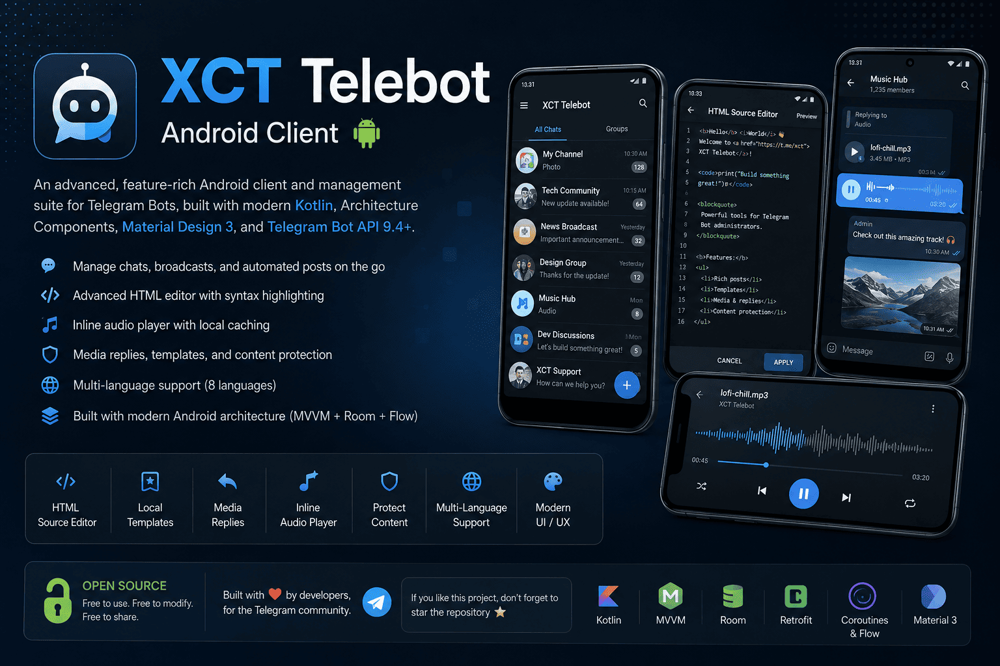

<p align="center">
  
</p>

<h1 align="center">XCT Telebot Android Client</h1>

<p align="center">
  Advanced Android client for managing Telegram Bots.
</p>

# XCT Telebot Android Client

> **An advanced, feature-rich Android client and management suite for Telegram Bots, built with modern Kotlin, Architecture Components, Material Design 3, and Telegram Bot API 9.4+.**

---

## 🌟 Overview & Key Features

**XCT Telebot** is a professional-grade mobile application designed to empower administrators and bot developers to manage Telegram chats, broadcasts, automated posts, and inline interactions directly from their Android devices. 

The application has undergone a comprehensive architectural and UI/UX upgrade, introducing powerful developer tools, secure content protection, multi-language localization, and robust media playback capabilities.

### Core Architecture & Highlights

| Feature Category | Description & Capabilities |
| :--- | :--- |
| **Advanced HTML Source Editor** | Replaces old form fields with a live syntax-highlighted HTML source editor (`BackendViewDialog`) for rich posts, custom tags (`<b>`, `<i>`, `<code>`, `<a>`), and direct pasting or editing. |
| **Local Template System** | Allows administrators to save frequently used post templates (text and interactive buttons only, excluding media attachments) into a local Room database for instant reuse. |
| **Comprehensive Media Replies** | Full support for replying to any message type—including text, photos, videos, audio notes, documents, and stickers—with visual preview bubbles (`replyToMediaType`) and correct Telegram API binding (`reply_to_message_id`). |
| **Inline & Local Audio Player** | Integrated Telegram-style inline audio bubbles with live progress bar and play/pause controls, plus a dedicated full-screen `AudioPlayerActivity` with automatic local caching for remote URLs (`mp3`, `m4a`, `wav`, `m4v`, `ogg`). |
| **Global Content Protection** | Extended "Protect Content" toggle (`protect_content`) covering all outgoing messages, media groups, invoices, and advanced posts to prevent forwarding and saving across all chats. |
| **Modern Material UI & FAB** | Comfortable dark mode with blue-grey and muted red tones, card-based preferences, and a prominent Floating Action Button (FAB) for adding chats by ID. |
| **Multi-Language Localization** | Unified "Change Language" dialog supporting 8 languages (English, Arabic, Bengali, Spanish, Hindi, Indonesian, Russian, Chinese) with robust `localeConfig` integration. |

---

## 📱 Architecture & Technical Stack

- **Language & UI:** Kotlin, Material Components (Material 3), ConstraintLayout, CoordinatorLayout, SpannableStrings for rich text formatting.
- **Architecture:** MVVM (Model-View-ViewModel), Coroutines & Flow for asynchronous reactive operations, Repository pattern.
- **Local Storage:** Room Database (v12) with entities for chats, messages, join requests, moderated members, and post templates.
- **Networking:** Retrofit2 with Gson converter, OkHttp3 logging and multipart upload interceptors for Telegram Bot API integration.
- **Media & Playback:** MediaPlayer, Glide for asynchronous image loading and thumbnail caching, custom video thumbnail extraction.

---

## 🚀 Getting Started & Build Instructions

### Prerequisites
- **Android Studio** (Hedgehog / Iguana or newer recommended)
- **Android SDK** (API level 24 to 34+)
- **JDK 17**

### Building from Source
1. Clone or extract the repository into your local machine.
2. Open Android Studio and select **Open an Existing Project**, pointing to the project directory.
3. Allow Gradle to sync dependencies (Room, Retrofit, Glide, Material Components).
4. Connect an Android device or start an emulator (API 24+).
5. Click **Run 'app'** to build and install the application.

---

## 🗂️ Project Structure

```text
com.example.xcttelebot/
│
├── adapter/             # RecyclerView adapters for chats, messages (inline audio/replies), and templates
├── data/
│   ├── api/             # Retrofit client and Telegram API interface definitions
│   ├── database/        # Room Database, DAOs, and Entity models (Templates, Messages, Chats)
│   └── repository/      # Repositories handling API requests, local DB caching, and sync
├── ui/
│   ├── audioplayer/     # Full-screen local/remote audio player activity
│   ├── home/            # Main chat list with FAB and drawer navigation
│   ├── messagebuilder/  # Advanced post builder and full HTML source editor dialog
│   ├── messages/        # Chat interaction activity supporting media replies and inline playback
│   ├── apppreferences/  # Card-based settings and unified language change dialog
│   └── ...
└── utils/               # File converters, video thumbnail extractors, and privacy managers
```

---

## 🔒 Privacy & Content Protection

When **Protect Content** is enabled in the privacy settings, the application automatically appends `protect_content=true` to all outbound messages, media uploads, media groups (albums), and advanced broadcasts. This restricts users from forwarding messages or saving media from the bot chats, ensuring maximum channel and group security.

---

## 🤝 Contributing & License

Contributions, bug reports, and feature requests are welcome. Feel free to fork the repository and submit pull requests for review.

---
*Developed with ❤️ as an open-source contribution for Telegram Bot developers.*
